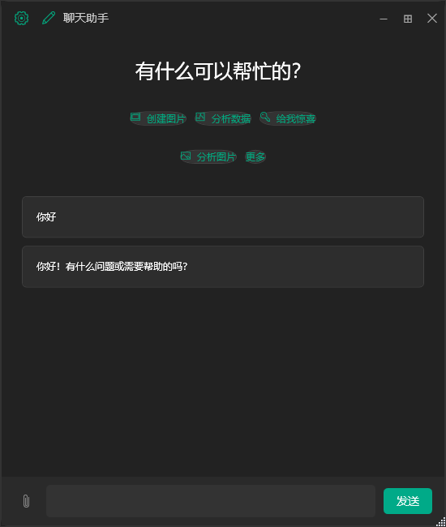
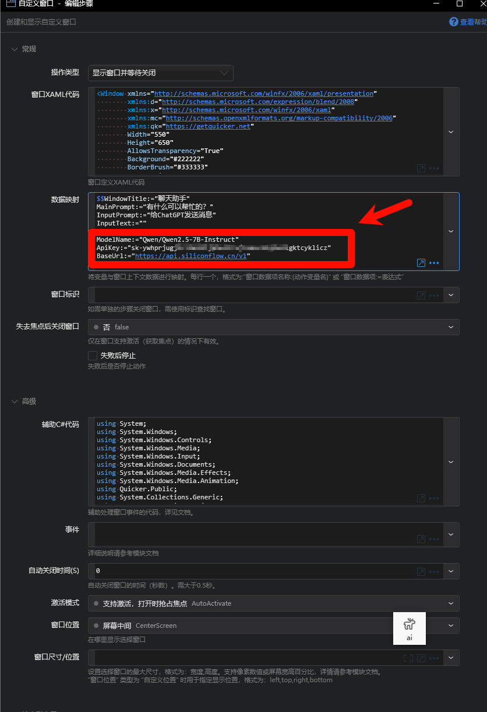
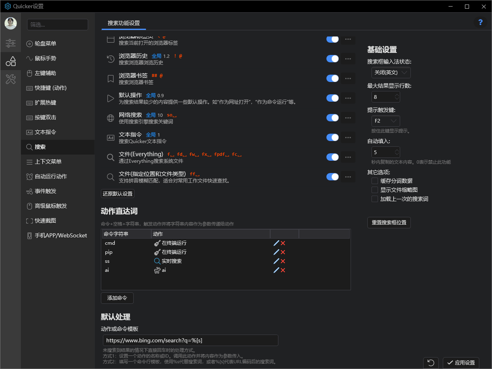

# Quicker Open Chat

一个基于Quicker平台的聊天应用，支持多种AI模型对话。

## 快速安装
[动作链接](https://getquicker.net/Sharedaction?code=81a560bf-c9a5-4dab-355b-08dd6a2b7d8c)

如何在quicker中设置快速调用动作

## 功能特点

- 支持多种AI模型
- 支持代码块显示
- 支持流式响应
- 支持自定义提示词
- 完整的错误处理和日志记录

## 使用说明

1. 在Quicker中创建新动作
2. 将代码复制到动作中
3. 在界面设置中配置相应的API密钥和模型参数
4. 运行动作开始对话

## 注意事项

- API密钥等敏感信息请在Quicker界面中设置
- 定期检查日志文件大小
- 建议使用Quicker的变量功能管理配置 